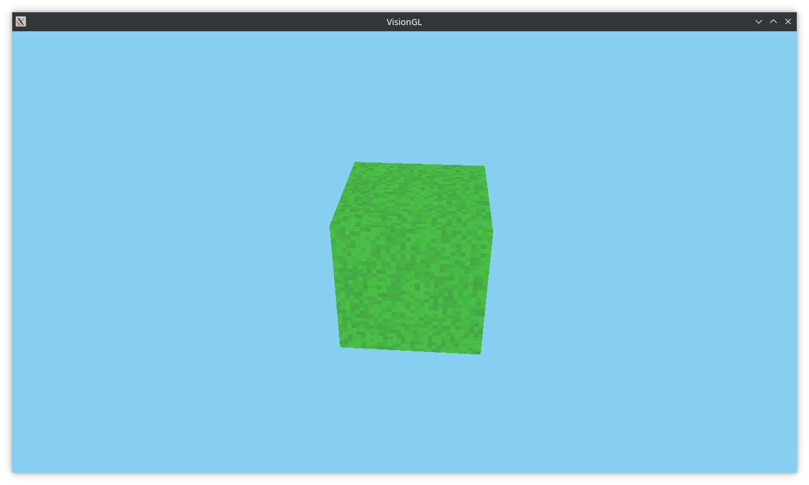

# visionGL
A opengl graphics library witten in c++.

## Screenshot

### Build  
#### With Linux  
Install the libraries and compiler:  
On Arch:  
`sudo pacman -S glfw glm glew clang make`  
And then run make:  
`make run`